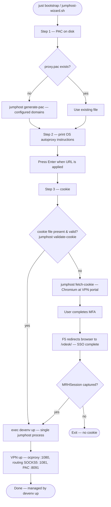

# VPN Jumphost

A devenv-managed VPN jumphost that connects to an F5 BIG-IP APM VPN with `openconnect`, accepts an F5 session cookie, and exposes a local SOCKS5 proxy on loopback so host applications can selectively route traffic through the VPN session. A PAC file generator and a small PAC HTTP server are included so browsers can decide which traffic goes through the jumphost. A routing SOCKS5 proxy sits in front of ocproxy and applies per-domain routing rules, so any SOCKS5-capable tool (git, curl, SSH, etc.) can use a single proxy address (`socks5h://127.0.0.1:1081`) without needing PAC support.

Traffic is selective and proxy-based: you keep normal host networking and only send chosen domains or IP ranges through the jumphost.

**Everything runs as your normal user.** `openconnect` is launched with `--script-tun --script "ocproxy ..."`, which means it does **not** create a kernel TUN device. Instead, openconnect spawns [ocproxy](https://github.com/cernekee/ocproxy) as its tunnel peer, hands it the VPN's IP packets over a socketpair, and lets ocproxy's userspace TCP/IP stack (lwIP) serve SOCKS5 on loopback. The `jumphost` binary's routing proxy sits in front on port 1081 and ocproxy listens on port 1080. No `sudo`, no namespace, no `/dev/net/tun` access required.

**Single binary.** The entire supervisor — cookie validation/refresh, openconnect lifecycle, routing SOCKS5 proxy, PAC HTTP server, sleep/wake detection — is one Rust binary (`target/release/jumphost`) built from the crate at the repo root. There is no Python runtime and no separate proxy/PAC-server processes.

**Platforms:** Linux and macOS. Both are supported by the codebase; Linux is the primary daily-driver target and gets the most testing. The design has no Linux-specific dependencies (no `/dev/net/tun`, no namespace, no `sudo`), and both `openconnect` and `ocproxy` are available from nixpkgs on both platforms.

**No Docker required.** All services (`openconnect`, `ocproxy`, the routing proxy, the PAC HTTP server) run as native processes managed by the `jumphost` binary, optionally supervised by [devenv](https://devenv.sh/) (process-compose).

## Prerequisites

| | |
|---|---|
| **devenv / nix** | Installed per [devenv.sh/getting-started](https://devenv.sh/getting-started/). Provides `openconnect`, `ocproxy`, `just`, and the Rust toolchain. On Linux, also provides `chromium`; on macOS, install Google Chrome or Chromium system-wide (it is not available from nixpkgs). |
| **just** | Optional but recommended for the `just` recipes. You can run [`scripts/jumphost-wizard.sh`](scripts/jumphost-wizard.sh) directly without it. |

The `jumphost` binary must be built (`just build`, i.e. `cargo build --release`) before first use. `devenv shell` provides the Rust toolchain needed for the build.

## Initial setup

From inside the project directory:

```bash
devenv shell        # loads openconnect, ocproxy, just, rust (+ chromium on Linux)
just build          # cargo build --release → target/release/jumphost
just bootstrap
```

> **First-time setup:** The binary ships with no compiled-in VPN URL or domain defaults. Copy [`docs/config.example.toml`](docs/config.example.toml) to `~/.config/vpn-jumphost/config.toml` and adjust the values for your VPN endpoint before running `just bootstrap`.

The bootstrap will:

1. Generate `proxy.pac` if it does not exist (via `jumphost generate-pac`).
2. Print OS-specific instructions to set your desktop's automatic proxy URL (`http://127.0.0.1:8091/proxy.pac`). Apply the URL, then press Enter.
3. Open Chromium at the configured VPN URL (via `jumphost fetch-cookie`), wait for SSO + MFA, capture the `MRHSession` cookie silently, and save it to `~/.local/state/vpn-jumphost/cookie` (mode 600). If a valid cookie file already exists (verified by `jumphost validate-cookie`), this step is skipped.
4. `exec devenv up` — process-compose starts a single `jumphost` process that runs openconnect+ocproxy (SOCKS5 on port 1080), the routing SOCKS5 proxy on port 1081, and the PAC HTTP server on port 8091. No sudo prompt.

## Starting and stopping

When the bootstrap has run, you can use `just start` to start everything in the foreground (Ctrl-C to stop). Remember to `just build` first if you haven't already, or after pulling new changes. A validity check is performed on the cookie, and if it's still valid, the login procedure will be skipped.

`just start` runs `jumphost -c docs/config.example.toml run --serve-pac`. The routing proxy is always started on `127.0.0.1:1081` and the PAC server is bound to `127.0.0.1:8091`. Override the config file with `-c` or a user-local `~/.config/vpn-jumphost/config.toml`.

To run in the background use `just start-detached` — the daemon logs to `~/.local/state/vpn-jumphost/jumphost.log`. To stop the daemon, use `just stop` (sends SIGTERM to the PID in `~/.local/state/vpn-jumphost/jumphost.pid`).

## Automatic credentials

Credentials and all other settings can be configured via a TOML config file at `~/.config/vpn-jumphost/config.toml` (or pass `-c / --config FILE` to use a different path; see [spec.md § Config File](spec.md#config-file) for the full reference), via environment variables, or via a `.env` file in the project root.

Create a `.env` file in the project root (already in `.gitignore`):

```bash
# .env
VPN_USERNAME=your.email@example.com
VPN_PASSWORD=your_password
```

Alternatively, point to secret files (useful for container/systemd secret mounts):

```bash
# .env
VPN_USERNAME_FILE=/var/run/secrets/vpn_user
VPN_PASSWORD_FILE=/var/run/secrets/vpn_pass
```

Environment variables take precedence over file contents. The browser automation fills in the email/password automatically; you only need to confirm the MFA prompt.

## Other recipes

See `just --list` for the full list. The main ones are:

- `build` — `cargo build --release`
- `fetch-cookie` — `jumphost fetch-cookie` (Chromium SSO capture)
- `validate-cookie` — `jumphost validate-cookie` (exit 0/1/2)
- `pac-gen` — write `proxy.pac` to disk via `jumphost generate-pac`
- `pac-show` — print PAC to stdout
- `start` — `jumphost -c docs/config.example.toml run --serve-pac` in the foreground
- `start-detached` — same, but via `nohup`; writes pid/log under `$XDG_STATE_HOME/vpn-jumphost/`
- `stop` — SIGTERM the detached PID
- `test` — `cargo test --release`
- `test-curl [URL]` — curl `URL` via `socks5h://127.0.0.1:1081`; prints response headers + body and a status/timing summary
- `test-cluster [USER@HOST]` — SSH (BatchMode) to `HOST` through the SOCKS5 proxy and run a short remote command; smoke-tests SSH connectivity over the VPN

### Bootstrap flowchart

This matches [`scripts/jumphost-wizard.sh`](scripts/jumphost-wizard.sh) (`just bootstrap`). The PAC HTTP server is no longer a separate process — it is started by `jumphost run --serve-pac` along with everything else when `devenv up` takes over, so the wizard no longer needs an intermediate "start PAC server" step.



## Running as a systemd user service

For a daily-driver setup that survives logout/reboot and laptop sleep/wake without `devenv up`, the project ships a ready-to-customize unit at [`contrib/vpn-jumphost.service.example`](contrib/vpn-jumphost.service.example). It runs `target/release/jumphost run --serve-pac` directly: the binary validates and refreshes the F5 cookie, launches `openconnect` (which spawns `ocproxy`), serves the PAC file, re-checks the cookie at a configurable interval, and detects suspend/resume (logind `PrepareForSleep` on Linux, `NSWorkspaceDidWakeNotification` on macOS, with a wall-clock skew fallback) so the tunnel comes back automatically after the laptop wakes up.

Logging goes to stderr in a journald-friendly format.

```bash
just build                              # produce target/release/jumphost
mkdir -p ~/.config/systemd/user
cp contrib/vpn-jumphost.service.example ~/.config/systemd/user/vpn-jumphost.service
# Edit the /CHANGE/ME paths in the unit file, then:
systemctl --user daemon-reload
systemctl --user enable --now vpn-jumphost.service
journalctl --user -u vpn-jumphost.service -f
```

Direct invocation works too:

```bash
just start                                                  # foreground; same flags as the service
./target/release/jumphost run --serve-pac --check-interval 300 -v
```

## Using the Nix flake

The project includes a `flake.nix` that builds the `jumphost` binary as a standalone Nix package with all runtime dependencies (`openconnect`, `ocproxy`, and `chromium` on Linux) wrapped on `PATH`. This is the recommended way to integrate the jumphost into a NixOS or home-manager configuration.

**Overlay usage** — add the overlay to your nixpkgs and use `pkgs.vpn-jumphost`:

```nix
# flake.nix (NixOS or home-manager)
{
  inputs.vpn-jumphost.url = "github:USER/REPO";

  # ...

  nixpkgs.overlays = [ vpn-jumphost.overlays.default ];

  # NixOS
  environment.systemPackages = [ pkgs.vpn-jumphost ];

  # or home-manager
  home.packages = [ pkgs.vpn-jumphost ];
}
```

**Direct package reference** — skip the overlay and reference the package directly:

```nix
environment.systemPackages = [
  vpn-jumphost.packages.${system}.default
];
```

**Quick try:**

```bash
nix run github:USER/REPO
```

**macOS note:** Chromium is not available from nixpkgs on macOS. Install Chrome or Chromium system-wide and set `CHROMIUM_PATH`, or let `chromiumoxide` auto-detect it.

**systemd integration:** The flake pairs well with the systemd service example at [`contrib/vpn-jumphost.service.example`](contrib/vpn-jumphost.service.example). Set `ExecStart` to `${pkgs.vpn-jumphost}/bin/jumphost run --serve-pac` (or the equivalent absolute store path) and the unit will use the wrapped binary with `openconnect` and `ocproxy` already on `PATH`.

## Documentation

- [**Functional specification**](spec.md) — full system spec: architecture, all features, workflows, configuration reference, open questions
- [Architecture (BYOD, F5, OpenConnect, ocproxy, devenv, PAC)](docs/architecture.md)
- [Running the services with devenv](docs/run.md)
- [PAC files and local proxies](docs/pac.md)
- [SSH via `ProxyCommand` and OpenSSH config](docs/ssh.md)

**Mermaid diagrams:** Several docs use fenced `mermaid` code blocks. [GitHub renders them](https://github.blog/changelog/2022-02-14-add-new-mermaid-diagrams-and-markdown-expansions-to-gists/) when you view Markdown in the browser. For **Cursor / VS Code**, open the Markdown preview and install the workspace-recommended **Markdown Preview Mermaid Support** extension (see [`.vscode/extensions.json`](.vscode/extensions.json)).

## Ports

When the jumphost is running, these ports are bound to `127.0.0.1`:

| Port | Protocol | Service |
| ---- | -------- | ------- |
| 1080 | SOCKS5   | ocproxy (VPN tunnel endpoint, upstream of routing proxy) |
| 1081 | SOCKS5   | routing proxy (user-facing; per-domain VPN-vs-direct routing) |
| 8091 | HTTP     | PAC file served by the in-process tokio/hyper server |

Use `socks5h://127.0.0.1:1081` for all SOCKS5 clients. The routing proxy handles per-domain routing: VPN-domain traffic goes through the tunnel and everything else goes direct.

## Cookie methods

The `jumphost` binary reads the F5 session cookie from a file:

- **`VPN_COOKIE_FILE`** — path to a file containing the cookie. Default `~/.local/state/vpn-jumphost/cookie` (mode 600). Also configurable as `cookie_file` in `config.toml`.

On startup, `jumphost run` calls `jumphost validate-cookie` against the VPN endpoint. If the cookie is expired, invalid, or the file is missing, `jumphost fetch-cookie` is invoked automatically: a Chromium window opens for SSO + MFA and the captured `MRHSession` cookie is written back to `VPN_COOKIE_FILE`. The same validate/refresh cycle runs periodically while the supervisor is up (interval controlled by `JUMPHOST_CHECK_INTERVAL`, default 300 s).

## Automatic login credentials

For fully automated browser login (when using `just bootstrap` or `just fetch-cookie`), provide your VPN credentials via environment variables:

- **VPN_USERNAME** — Your VPN email address
- **VPN_PASSWORD** — Your VPN password

**Recommended setup:** create a `.env` file in the project root:

```bash
# .env
VPN_USERNAME=your.email@example.com
VPN_PASSWORD=your_secure_password
```

The `.env` file is already in `.gitignore`. The `jumphost` binary loads `.env` from the current working directory automatically at startup (via the `dotenvy` crate), so it works whether you use `just start`, `devenv up`, or invoke the binary directly. When credentials are provided, the browser automation will:

1. Navigate to the configured VPN URL
2. Automatically fill in your email and password (or click the matching tile when Microsoft shows the "Pick an account" picker)
3. Wait for you to complete the MFA step
4. Capture the session cookie and save it to `VPN_COOKIE_FILE`

### File-based credentials

As an alternative to environment variables, credentials can be read from files. This is useful for secret-mounting workflows (e.g. Docker/Podman secrets, systemd `LoadCredential=`, or Kubernetes volume mounts):

- **VPN_USERNAME_FILE** — Path to a file containing the username (contents are trimmed)
- **VPN_PASSWORD_FILE** — Path to a file containing the password (contents are trimmed)

Example:

```bash
# Point to mounted secret files
export VPN_USERNAME_FILE=/var/run/secrets/vpn_user
export VPN_PASSWORD_FILE=/var/run/secrets/vpn_pass
just start
```

**Precedence:** Environment variables (`VPN_USERNAME` / `VPN_PASSWORD`) always take precedence over the file-based variants. If both are set, the env var wins.

### Persistent browser session reuse

`just fetch-cookie` and the bootstrap login step drive Chromium (via the `chromiumoxide` crate and the Chrome DevTools Protocol) against a persistent user-data directory, so SSO/session state can be reused between runs.

- Default profile path: `${XDG_STATE_HOME:-$HOME/.local/state}/vpn-jumphost/chromium-profile`
- Override path: set `VPN_BROWSER_PROFILE_DIR`
- Override the Chromium binary: set `CHROMIUM_PATH` (or `CHROME`). Inside `devenv shell` on Linux, `CHROMIUM_PATH` is exported automatically to the nixpkgs `chromium`. On macOS, `chromiumoxide` auto-detects a system-installed Chrome or Chromium.

**Alternative:** Set environment variables directly:

```bash
export VPN_USERNAME="your.email@example.com"
export VPN_PASSWORD="your_password"
just bootstrap
```

**Security note:** Credentials are only used for the initial browser login automation. They are not embedded in the cookie file or used beyond authentication.

See [Running the services with devenv](docs/run.md) for ways to start the services without the wizard.

## What this solves

Transparent host-level routing for a corporate VPN with domain-based rules is awkward to set up on a personal workstation. A proxy jumphost is the practical approach: the routing proxy on port 1081 handles per-domain routing automatically, so all tools — browsers, git, curl, SSH — can use a single `socks5h://127.0.0.1:1081` proxy. By running openconnect with `--script-tun` and ocproxy's userspace TCP/IP stack, the entire tunnel exists in user space — no kernel TUN, no namespace, no `sudo` — and only host processes that explicitly point at `127.0.0.1:1081` can reach VPN-side resources. Everything else is unaffected.

If you need full non-proxy-aware packet routing for arbitrary local processes, that is a different setup (host firewall or system-level VPN client outside this repo).
