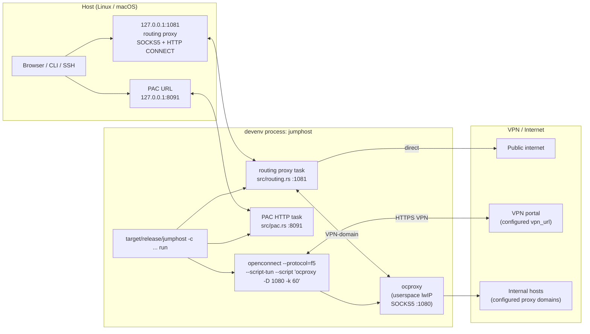
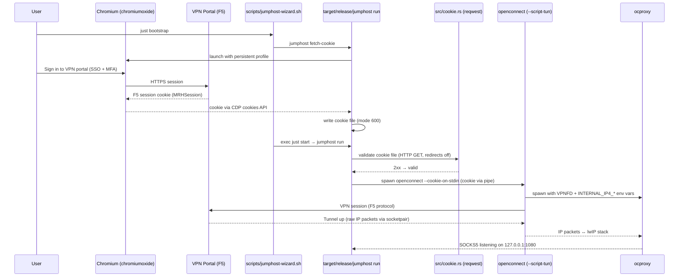

# Architecture

This document describes how the VPN jumphost fits together: the **F5 BIG-IP APM** portal, **F5**-based VPN access, **OpenConnect** running under **devenv** with **ocproxy** as its userspace tunnel peer, and optional **PAC**-based routing on the host.

## Concepts at a glance

| Piece | Role |
| --- | --- |
| **VPN portal** | The F5 BIG-IP APM web portal (configured via `vpn_url`). You sign in in a browser and obtain a **session cookie** used to authenticate the VPN client. |
| **F5** | The VPN front end is exposed as an **F5 BIG-IP APM**–style portal. OpenConnect speaks the **`f5`** protocol to that endpoint (not a generic SSL VPN profile). |
| **`jumphost` binary** | Single Rust binary built from the repo root (`target/release/jumphost`). One process owns everything: cookie management, openconnect supervision, the routing proxy, and the PAC HTTP server. Subcommands: `run`, `fetch-cookie`, `validate-cookie`, `generate-pac`, `authenticate`, `doctor`, `test-tunnel`. |
| **`src/vpn.rs`** | Spawns and supervises `openconnect` via `tokio::process::Command`, with `--script-tun --script "ocproxy …"`. openconnect does **not** open `/dev/net/tun`; it spawns ocproxy as its tunnel peer and exchanges raw IP packets over a socketpair. |
| **ocproxy** | A userspace TCP/IP stack (lwIP) launched by openconnect. Terminates the VPN's IP packets in user space and serves SOCKS5 on `127.0.0.1:1080`. The routing proxy on port 1081 sits in front. |
| **`src/config.rs`** | Shared configuration: constants, config-file lookups, and TOML config file integration (`src/config_file.rs`). **Single source of truth** for the `PROXY_DOMAINS` / `DIRECT_DOMAINS` lists used by both the PAC generator and the routing proxy. All settings can be overridden via a TOML config file (`-c / --config FILE`, or `$XDG_CONFIG_HOME/vpn-jumphost/config.toml` by default; see [spec.md § Config File](../spec.md#config-file)). Precedence: CLI > config file > compiled-in default. |
| **`src/routing.rs`** | In-process routing proxy (tokio task) on `127.0.0.1:1081`. Accepts both SOCKS5 and HTTP CONNECT (auto-detected per connection). Per-domain routing: forwards VPN-domain traffic upstream to ocproxy on `127.0.0.1:1080`, connects everything else directly. Always started by the supervisor. Domain lists are resolved via [`src/config.rs`](../src/config.rs) (config file override → compiled-in defaults) — the single source of truth shared with PAC generation. |
| **`src/pac.rs`** | In-process PAC generator **and** an embedded tokio/hyper HTTP server on `127.0.0.1:8091` when `serve_pac = true` in the config file. No external static-file server. |
| **`src/cookie.rs`** | Cookie validation (reqwest + rustls, redirects disabled) and Chromium-based capture (`chromiumoxide` over the Chrome DevTools Protocol, persistent user-data-dir). No Node.js, no Playwright driver. |
| **`src/jumphost.rs`** | The supervisor monitor loop tying everything together: periodic re-validation, refresh-on-expiry, restart-on-refresh, sleep/wake handling. |
| **`src/sleepwake/`** | Suspend/resume detection. Linux: `zbus` subscribes to `org.freedesktop.login1.Manager.PrepareForSleep`. macOS: `objc2`+`block2` observe `NSWorkspaceDidWakeNotification` on a dedicated `NSRunLoop` thread. Wall-clock skew fallback when neither is available. |
| **devenv** | [devenv.sh](https://devenv.sh/) provides the toolchain (`just`, `openconnect`, `ocproxy`, `chromium`, Rust) **and** the process supervisor. `devenv up` now runs **one** process, `jumphost`, that execs `./target/release/jumphost -c docs/config.example.toml run` (example config sets `serve_pac = true`). |
| **PAC** | A Proxy Auto-Configuration script served on host loopback tells browsers **which** traffic goes to `SOCKS5 127.0.0.1:1081` and which stays **direct** (notably the VPN portal itself, per `[domains].direct`). Since the routing proxy is always on, browsers and tools can also use `socks5h://127.0.0.1:1081` or `http://127.0.0.1:1081` (HTTP CONNECT) without a PAC file. |

## System context

The VPN tunnel is terminated inside `ocproxy`'s userspace TCP/IP stack — there is no kernel route into the VPN network at all. The routing proxy on `127.0.0.1:1081` is the universal client target: per-domain it either forwards to ocproxy on `127.0.0.1:1080` (VPN-routed) or connects directly. Applications point at `socks5h://127.0.0.1:1081` (SOCKS5) or `http://127.0.0.1:1081` (HTTP CONNECT); everything else on the host is unaffected.

## BYOD, F5 cookie, and OpenConnect

You never type a password into OpenConnect: authentication is the **same session cookie** the BYOD portal would use for VPN. OpenConnect is started with **`--protocol=f5`** against the configured **`vpn_url`**.

## Service supervision

`devenv up` starts **one** process-compose process, `jumphost`, whose `exec` is `./target/release/jumphost -c docs/config.example.toml run`. The example config sets `serve_pac = true`. The binary itself:

- Validates the cookie file synchronously at startup (reqwest GET of `<vpn_url>/vdesk/vpn/index.php3?outform=xml`, redirects disabled — 2xx = valid, 3xx/404 = invalid, network error = unknown).
- If invalid or missing, launches Chromium via `chromiumoxide` for a refresh and writes the refreshed cookie to the cookie file (mode 600). Authenticator pushes share a three-attempt budget across all refresh sessions in the supervisor. The MFA method picker is debounced so a lingering page cannot be clicked repeatedly.
- If refresh fails or three MFA notifications go unanswered, keeps the supervisor, routing proxy, and PAC server alive without a tunnel. Browser authentication remains paused after the third notification; a later `jumphost authenticate` supplies a valid cookie and lets the monitor start the VPN. Staying alive also prevents systemd/launchd failure restarts from resetting the safety limit.
- Spawns `openconnect` with `tokio::process::Command`, passing `--protocol=f5 --cookie-on-stdin --script-tun --script "ocproxy -D 1080 -k 60" the configured vpn_url` and writing the cookie to its stdin.
- Concurrently spawns the routing proxy tokio task on `127.0.0.1:1081` and the PAC HTTP tokio task on `127.0.0.1:8091`.
- Runs the supervisor monitor loop: periodic cookie revalidation, sleep/wake re-checks, and openconnect restart when the cookie was refreshed.

There is no shell wrapper and no `exec` dance — the binary owns the openconnect child directly and uses `nix::sys::signal::kill` to send `SIGTERM` for shutdown / restart. process-compose only ever sees the `jumphost` PID and sends SIGTERM straight to it; the binary then tears down openconnect (which in turn cleans up ocproxy via the `--script-tun` socketpair) and stops its in-process tasks.

## Traffic paths on the host

`just start` uses the example config with `serve_pac = true`. The routing proxy always starts on port 1081 and ocproxy lives on port 1080 behind it. Clients always point at `127.0.0.1:1081`:

- **Any SOCKS5 client** (browser, git, curl, SSH): point at `socks5h://127.0.0.1:1081`. The routing proxy checks the destination domain against the effective domain lists (from `config.toml` or compiled-in defaults in [`src/config.rs`](../src/config.rs)) and either forwards VPN-domain traffic to ocproxy (port 1080) or connects directly.
- **HTTP CONNECT clients** (desktop apps, Zed, VS Code, Electron apps): set `http_proxy=http://127.0.0.1:1081` and `https_proxy=http://127.0.0.1:1081`. The routing proxy auto-detects HTTP CONNECT requests and applies the same per-domain routing rules.
- **Browser with PAC:** Browsers use the PAC file at `http://127.0.0.1:8091/proxy.pac` for automatic proxy configuration. The PAC points at `SOCKS5 127.0.0.1:1080` (ocproxy) because the PAC script already applies per-domain rules. Non-browser tools use the routing proxy on 1081 instead.
- **CLI tools:** Use `--proxy socks5h://127.0.0.1:1081` or set `ALL_PROXY=socks5h://127.0.0.1:1081`. VPN-vs-direct routing is handled transparently by the routing proxy.
- **SSH:** Uses **`ProxyCommand`** with `nc -X 5 -x 127.0.0.1:1081` — see [`ssh.md`](ssh.md). Domains listed in `[domains].proxy` are routed through the VPN automatically.
- **Database clients (DBeaver, psql):** JDBC and GUI clients do not speak SOCKS5; wrap the app with proxychains or Proxifier — see [`databases.md`](databases.md).
- **VPN portal:** Always connects directly when listed in `[domains].direct`, so the VPN portal is reachable even when the tunnel is down.

## Related documentation

- [Running the services (devenv)](run.md) — flags, ports, cookies.
- [PAC files and local proxies](pac.md) — domain-based rules, loopback PAC server.
- [SSH via `ProxyCommand`](ssh.md) — reaching internal hosts over SSH.
- [PostgreSQL / DBeaver via proxychains](databases.md) — GUI database clients through the routing proxy.
