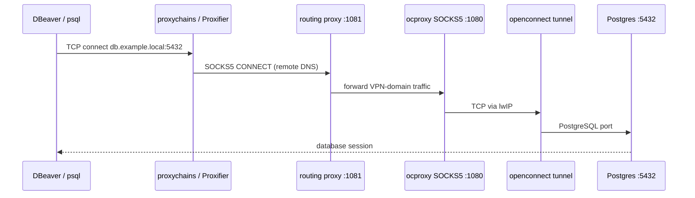

# PostgreSQL and database clients through the jumphost

GUI database clients (DBeaver, DataGrip, pgAdmin) and most JDBC drivers speak **plain TCP** to Postgres — they do not support SOCKS5 or PAC files. The jumphost exposes SOCKS5 on `127.0.0.1:1081` (routing proxy) and `127.0.0.1:1080` (full VPN).

**Recommended approach:** wrap the client once with **proxychains** (free) or **Proxifier** (macOS, commercial), then create as many connections as you need using real internal hostnames. No per-database port forwards.



## Prerequisites

1. Jumphost is running (`just start`, systemd user unit, or launchd agent).
2. `[domains].proxy` in `~/.config/vpn-jumphost/config.toml` includes the suffix your database hostnames use (for VITO: `vito.local` covers `*.vito.local`).
3. You connect by **hostname**, not IP. The routing proxy on port 1081 sends raw IP addresses direct; only domain names are matched against the config.

## Quick setup (just)

```bash
brew install proxychains-ng          # macOS; Debian/Ubuntu: apt install proxychains4
just proxychains-setup               # writes ~/.proxychains/proxychains.conf
just doctor                          # health check: config, cookie, :1081, proxychains
just test-db                         # TCP check to climkit.marvin.vito.local:5432
just dbeaver                         # launch DBeaver through the routing proxy
just pc -- psql -h climkit.marvin.vito.local -U me -d mydb
```

`just pc` runs any command through [`scripts/proxychains-wrap.sh`](../scripts/proxychains-wrap.sh), which picks up `proxychains4` / `proxychains-ng`, uses `~/.proxychains/proxychains.conf` (or `/etc/proxychains4.conf`), and warns if nothing is listening on port 1081. Override the config path with `PROXYCHAINS_CONF=/path/to/conf`.

Shipped template: [`docs/proxychains.conf.example`](proxychains.conf.example).

## Always use port 1081

Point every client wrapper at **`socks5 127.0.0.1 1081`**. The routing proxy applies the same per-domain rules as the PAC file: VPN domains through the tunnel, everything else direct. You do not need to choose between 1080 and 1081 per connection.

Use port 1080 only when you intentionally want **all** traffic through the VPN regardless of domain rules (rare).

## Test connectivity first

```bash
just test-db
# or manually:
nc -z -X 5 -x 127.0.0.1:1081 -w 5 climkit.marvin.vito.local 5432
```

If this succeeds, the VPN path to Postgres works. `curl` is not useful here — Postgres is not HTTP.

## proxychains (Linux and macOS)

Install:

```bash
# macOS
brew install proxychains-ng

# Debian/Ubuntu
sudo apt install proxychains4
```

Edit `~/.proxychains/proxychains.conf` (macOS Homebrew) or `/etc/proxychains4.conf` (Linux), or run `just proxychains-setup` to copy [`docs/proxychains.conf.example`](proxychains.conf.example):

```
strict_chain
proxy_dns
[ProxyList]
socks5 127.0.0.1 1081
```

`proxy_dns` is required. Without it, your OS resolves internal names like `*.vito.local` locally and the connection fails before traffic reaches the jumphost.

Run `jumphost doctor` (or `just doctor`) to verify config, cookie, listeners, and proxychains setup in one pass.

### psql (CLI)

```bash
just pc -- psql -h climkit.marvin.vito.local -p 5432 -U myuser -d mydb
```

On macOS with Homebrew, the binary may be `proxychains4` or `proxychains-ng` depending on the install.

### DBeaver

Start DBeaver through proxychains so every JDBC connection uses the SOCKS proxy:

```bash
just dbeaver
```

Or manually:

```bash
# macOS
proxychains4 /Applications/DBeaver.app/Contents/MacOS/dbeaver

# Linux (path may vary)
proxychains4 dbeaver
```

In DBeaver, create a normal PostgreSQL connection:

| Field | Value |
|---|---|
| Host | `climkit.marvin.vito.local` (real internal hostname) |
| Port | `5432` |
| Database | your database name |
| Username / Password | your credentials |
| SSH tab | **disabled** |

Repeat for each database — only host, port, database, and credentials change. No localhost, no SSH tunnel, no extra ports.

## Proxifier (macOS, alternative to proxychains)

Proxifier is often more reliable for GUI apps that open many TCP connections.

1. **Profile → Proxy Servers → Add** — SOCKS5, `127.0.0.1`, port `1081`.
2. **Profile → Proxification Rules → Add** — application `DBeaver.app`, action: proxy via `127.0.0.1:1081`.
3. Launch DBeaver normally from Applications.

Connection settings in DBeaver are the same as above (real hostname, SSH off).

## Scaling to many databases

Per-database local port forwards (`ssh -L`, `gost`, `socat`) do not scale past a handful of hosts. The app-wrapper model scales to hundreds of connections:

- **One** proxychains or Proxifier rule for the database client.
- **Many** DBeaver connections, each using its real `*.vito.local` hostname.

## What does not work

| Approach | Why |
|---|---|
| PAC file | Browsers only; JDBC clients ignore it. |
| Point DBeaver at `127.0.0.1` without a forwarder | Nothing listens on localhost for that database. |
| Connect by IP through 1081 | Routing proxy sends raw IPs direct, not through VPN. |
| One local port forward per database | Does not scale; use an app wrapper instead. |

## SSH tunnel alternative

If you have SSH access to a host inside the VPN, you can forward a single database with `ssh -L` and `ProxyCommand` — see [ssh.md](ssh.md). For many Postgres hosts without SSH bastions, proxychains or Proxifier is simpler.
