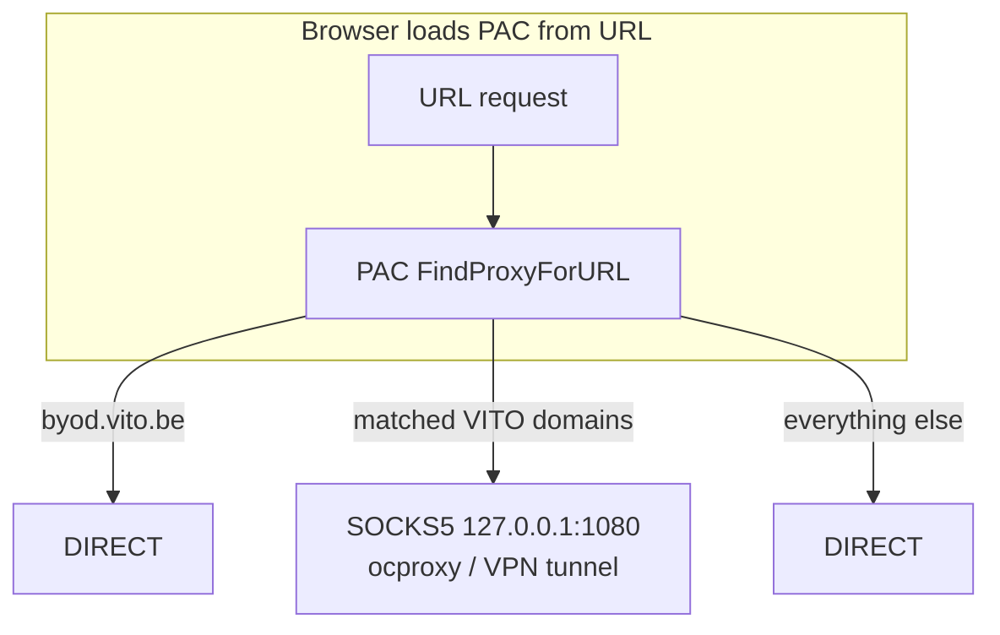

# PAC files and local proxies

## Goal: reach `https://byod.vito.be` whenever the VPN jumphost is off

Two separate things are involved:

1. **PAC rules** — The generated script sends **`byod.vito.be`** to `DIRECT` **before** any proxy rule, so the browser never uses the jumphost proxy for the BYOD portal. Regenerate after changing domains with `jumphost generate-pac` (see [Generate a PAC on the host](#generate-a-pac-on-the-host)).

2. **PAC URL** — The browser applies a PAC fetched from an **`http://` or `https://` URL** (not `file://`). That URL must work **even when the VPN services are not running**, or the browser never loads the script and BYOD rules never apply.



Browsers point at **ocproxy on port 1080**, not the routing proxy on 1081. The PAC script already decides which hosts go through the VPN; the routing proxy on 1081 is for non-PAC clients (curl, git, SSH).

### Recommended setup (loopback HTTP server)

Enable `serve_pac = true` at the **top level** of `~/.config/vpn-jumphost/config.toml` (not under `[credentials]`). Then set **automatic proxy configuration** to:

```text
http://127.0.0.1:8091/proxy.pac
```

The in-process PAC HTTP server starts with `jumphost run` and serves the generated script at `/proxy.pac` (and `/`) with `Content-Type: application/x-ns-proxy-autoconfig`.

#### macOS

```bash
networksetup -setautoproxyurl "Wi-Fi" "http://127.0.0.1:8091/proxy.pac"
networksetup -setautoproxystate "Wi-Fi" on
```

Or use **System Settings → Network → Wi-Fi → Details → Proxies → Automatic Proxy Configuration**.

Restart the browser after changing proxy settings.

#### Linux

- **GNOME:** **Settings → Network → Proxy → Automatic** → configuration URL.
- **Firefox:** **Settings → Network Settings → Automatic proxy configuration URL** (if the desktop does not propagate system proxy).

Do **not** set a **global** HTTP/SOCKS proxy to `127.0.0.1:1080` for all traffic; that would send everything through the jumphost. Use **automatic proxy configuration** with the PAC URL above.

### Domain defaults and customisation

Domain lists live in `[domains]` in `config.toml` and are shared with the routing proxy — see [`docs/config.example.toml`](config.example.toml). They control normal client traffic only. The Chromium instance launched by `jumphost` for VPN authentication uses `--no-proxy-server`, so the VPN portal and external SSO/MFA hosts always connect directly even if a matching hostname is accidentally included in `[domains].proxy`.

| Key | VITO default | Purpose |
|---|---|---|
| `[domains].proxy` | `vito.be`, `vito.local`, `int.vito.be`, `int.energyville.be` | Domains routed through the VPN |
| `[domains].direct` | `byod.vito.be` | Domains that always bypass the proxy |

## Generate a PAC on the host

```bash
jumphost generate-pac proxy.pac
```

Typical usage:

- **Browsers:** automatic proxy configuration URL pointing at `http://127.0.0.1:8091/proxy.pac`
- **SOCKS-aware CLI tools:** `socks5h://127.0.0.1:1081` (routing proxy; per-domain rules applied in-process)
- **SSH:** `ProxyCommand` with `nc -x 127.0.0.1:1081 -X 5 %h %p` — see [`ssh.md`](ssh.md)

Examples:

```bash
curl https://byod.vito.be
curl --proxy socks5h://127.0.0.1:1081 https://jenkins-rma.int.vito.be
```

Use `socks5h` (not `socks5`) when you want DNS resolution through the proxy — required for hostnames that only resolve via the VPN's DNS (e.g. `*.int.vito.be`).
