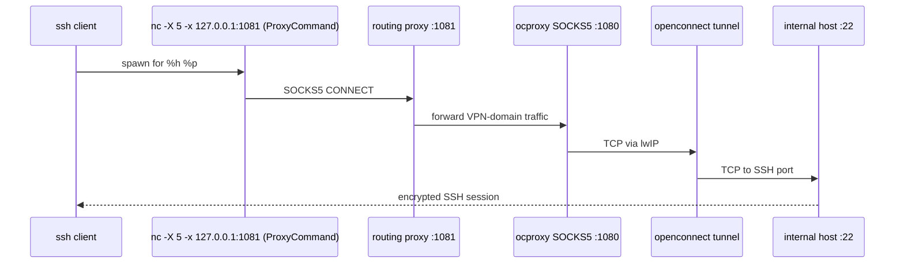

# SSH through the jumphost

SSH uses the local SOCKS5 proxy via `ProxyCommand` (PAC files are not consulted by `ssh`).



Use the OpenBSD `nc` (Debian/Ubuntu: `netcat-openbsd`). Resolve its path once:

```bash
command -v nc
```

Then:

```bash
nc="$(command -v nc)"
ssh -F /dev/null \
  -o User=robin \
  -o "ProxyCommand=$nc -x 127.0.0.1:1080 -X 5 %h %p" \
  internal-host.example.com
```

## Note on the routing proxy

The routing proxy is always started by `jumphost run` and listens on port 1081. ocproxy listens on port 1080 behind it. The routing proxy automatically recognizes configured VPN domains (from `[domains].proxy` in `config.toml`) and forwards them to ocproxy through the VPN tunnel, while other SSH targets connect directly.
